# **Array** in **JavaScript** 
 ### **What is Array?**

_An array in JavaScript is a type of global object that is used to store data,  use numbered indices starting from 0 to access specific items._

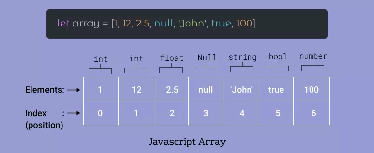

### **CHANGE  ELEMENTS  IN  ARRAY**
```
// Example 1.

let array ['go', 'sleep', 1, true, [4,5,6]]
array [2] = 3
console.log(array) // ['go', 'sleep', 3, true, [4,5,6]]
```
### **ARRAY METHODS**
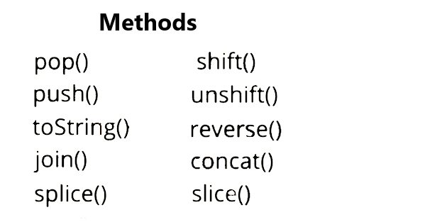

# . PUSH

_The push() method adds one or more elements to the end of an array and returns the new length of the array.The element(s) to add to the end of the array._

### Syntax: push(element0, element1, /* … ,*/ elementN)

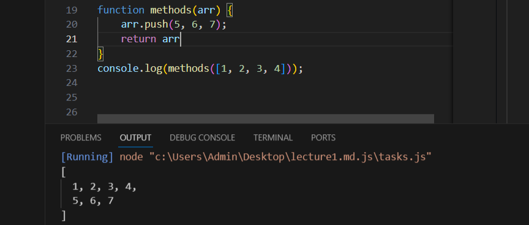
# . POP

### Syntax: pop()
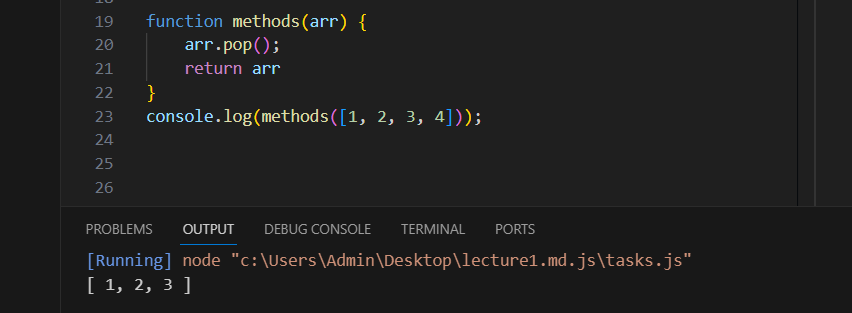
# . UNSHIFT

### Syntax: unshift(element0, element1, /* … ,*/ elementN)
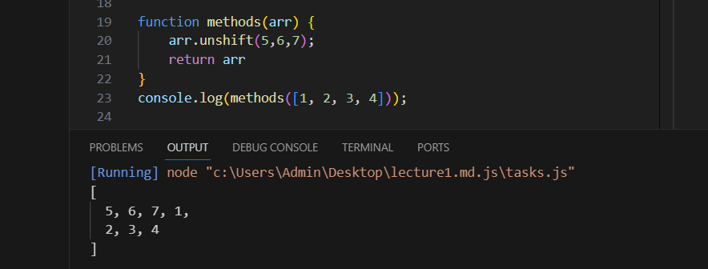
# . SHIFT

### Syntax: shift()
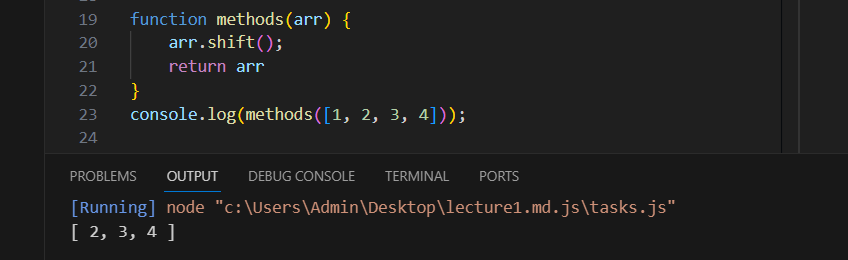
# . TOSTRING
_The toString() method returns a string representing the specified array and its elements. A string representing the elements of the array._

### Syntax: toString()
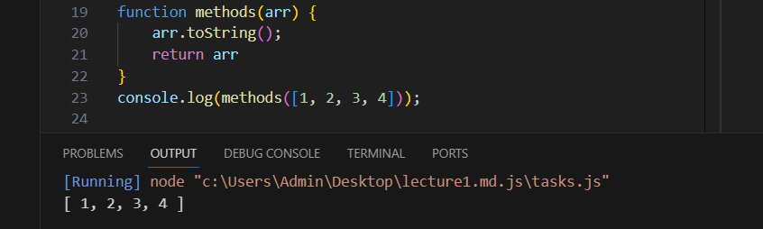
# . indexOf()
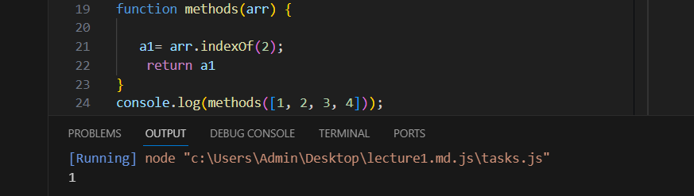
# . includes()
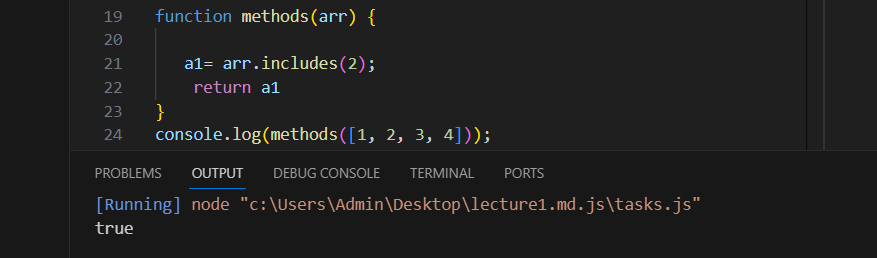
# . slice()
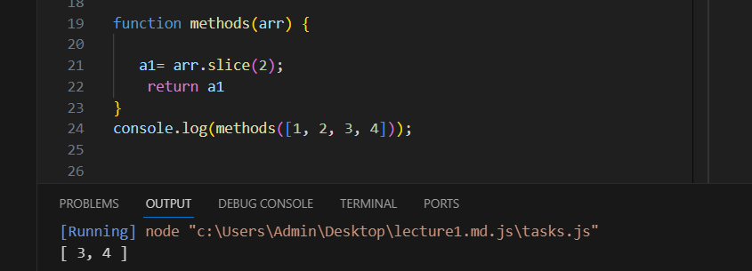
# . concat()
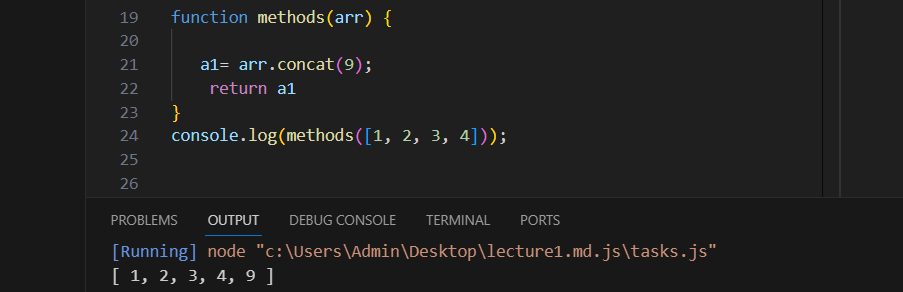
# . splice()
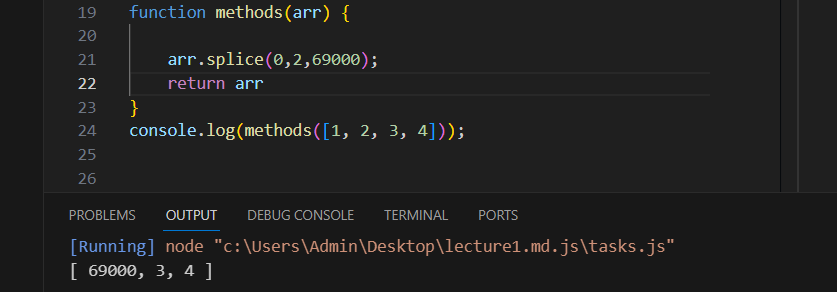


### **ARRAY METHODS CALLBACKS**
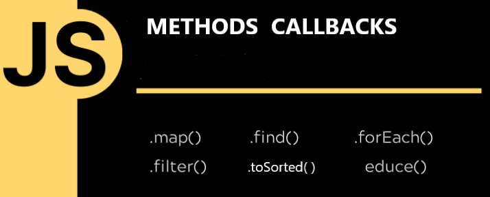


#### . map()

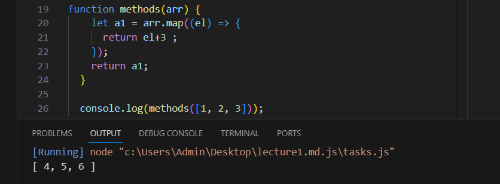

#### . foreach()
``` bash
 Array.forEach(callback(item,index,arr),thisValue)
```

___
#### . find()
```bash 
 let numbers = [10, 20, 30, 40];
 let firstEven = numbers.find(number => number % 2 === 0); // even number
 console.log(firstEven); // 20
```
Suntaxs:

_array.find(function(currentValue,index,arr),thisValue)_
___
#### . redyce()


```
 let numbers = [1, 2, 3, 4];
 let sum = numbers.reduce((accumulator, number) => accumulator + number, 0); // sum of all numbers
 console.log(sum); // 10
```

#### . filter()

``` bash
 let words = ["apple", "banana", "cherry", "date"];
 let longWords = words.filter(word => word.length > 5); // words longer than 5 characters
 console.log(longWords); // ["banana", "cherry"]
```

#### . toSorted


```
let res=arr.toSorted((a,b)=>{
    return a-b
})
console.log(res)
```